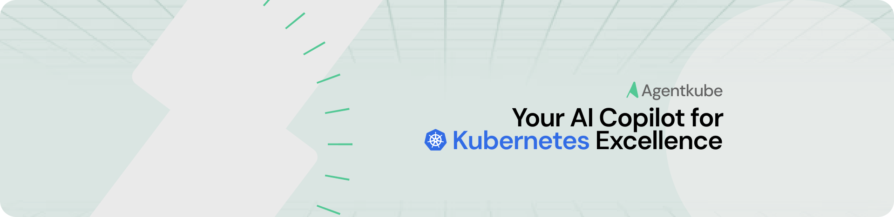

<!-- TEXT_SECTION:header:START -->

  

    <a href="https://agentkube.com" target="_blank">Website</a>&nbsp;&#8226;&nbsp;
    <a href="https://agentkube.com/pricing" target="_blank">Pricing</a>&nbsp;&#8226;&nbsp;
    <a href="https://docs.agentkube.com" target="_blank">Docs</a>&nbsp;&#8226;&nbsp;
    <a href="https://agentkube.com/about" target="_blank">About</a>&nbsp;&#8226;&nbsp;
    <a href="https://agentkube.com/contact" target="_blank">Contact</a>&nbsp;&#8226;&nbsp;
    <a href="https://github.com/agentkube/platform/issues" target="_blank">Issue Tracker</a>&nbsp;&#8226;&nbsp;
    <a href="https://auth.agentkube.com" target="_blank">Login</a>&nbsp;&nbsp;
  

  <h3 align="center">
    Run Kubernetes Like Never Before
  </h3>
  

  Meet the AI-powered future of Kubernetes management.  
  Automate, optimize, and secure your clusters effortlessly with Agentkube.
  

## What is Agentkube?

Agentkube is an AI-powered Kubernetes management platform that bridges the gap between developers and complex cluster operations. It simplifies Kubernetes adoption by automating cluster management, investigating issues, and providing intelligent solutions - all through an intuitive interface that speaks your language.

## Copyright & License

Copyright (c) 2025 Agentkube, Inc. - The content of this repository is released under the MIT license. Lens and the Lens Logo are trademarks of Agentkube, Inc.